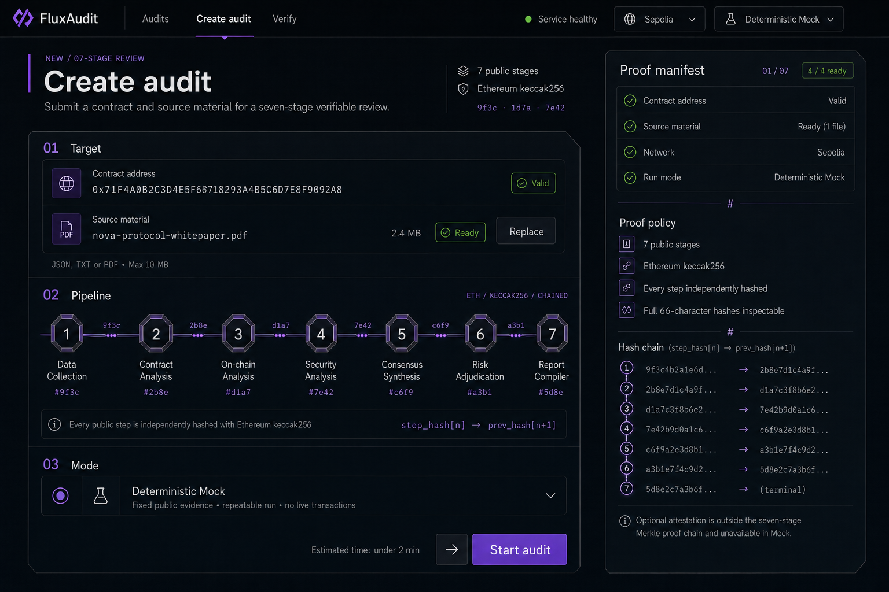

# FluxAudit Create Audit 视觉审计

## 审计范围

- 对象：`Create audit` 单页高保真视觉稿。
- 用户目标：提交合约与资料，确认七阶段验证策略后启动审计。
- 模式：UX、视觉系统与静态可访问性联合审计。
- 证据：`01-create-audit-current.png`。

## Step 1 — 填写完成、准备启动（健康度：B+）

页面已经具备稳定的信息架构和清晰的主任务，但字体层级、图标深度语言和部分组件状态尚未形成完整设计系统。当前适合作为视觉母版继续精修，不建议直接冻结为最终实现稿。

### 优点

1. 左侧任务区与右侧 Proof manifest 分工清楚，用户能快速判断“输入什么”和“系统将如何证明”。
2. 七阶段 Pipeline 已成为页面核心识别物，顺序、名称、`Ethereum keccak256` 和 `step_hash[n] → prev_hash[n+1]` 均被明确表达。
3. `Deterministic Mock`、Sepolia 和 `4 / 4 ready` 的运行前状态较可信，没有伪造实时链上活动。
4. 页面已摆脱通用卡片堆叠，切角、协议编号和等宽技术字段建立了初步品牌语言。

## 必须修改

### 1. 建立两级图标深度，而不是给所有图标统一加 2.5D

- 当前问题：Pipeline 节点具备金属切面，但合约、PDF、烧瓶、Proof policy 图标仍是纯平面描边，两个系统像来自不同产品。
- 修改：对象型图标使用浅 2.5D，包括合约目标、PDF、运行模式和七个阶段节点；状态/操作型图标继续使用平面线性，包括勾选、信息、箭头、下拉和链接。
- 光照规则：统一左上高光、右下阴影；高光只占外轮廓 1px，投影深度控制在 2–4px，禁止强烈悬浮。
- 结果：增加质感的同时，用户仍能通过“立体对象 / 平面操作”理解图标角色。

### 2. 重新定义字体角色与字重

- 当前问题：`Create audit` 过重，`Proof manifest` 与其他标题的字形气质不完全一致；小标题、正文和技术字段之间的字重差距过小。
- 建议字体系统：Geometric Grotesk 用于品牌与产品文本，IBM Plex Mono 类等宽字体仅用于地址、Hash、算法和编号。
- 标题：`Create audit` 42px / 600–650，字距约 `-0.03em`，不要继续使用接近 750 的重量。
- 导航：15px / 450；当前项 15px / 600。
- 区块：名称 18px / 600；紫色协议编号改为 13px / 600 的等宽字体，避免编号压过标题。
- 正文与字段标签：14–15px / 450–500；辅助说明 13px / 450。
- 技术数据：12–13px / 500，使用 tabular numerals，Hash 对齐会更稳定。

### 3. 把 CTA 做成一个组件

- 当前问题：底部箭头方块与紫色 `Start audit` 在视觉上像两个独立按钮。
- 修改：保留深色图标舱与紫色文字舱，但合并为单一按钮边界、单一悬停面和单一焦点环；高度 52px，内部分隔线即可。

### 4. 提升次级文字和技术紫色的对比度

- 当前问题：辅助说明、Hash 片段和 Pipeline 下方文字偏暗；在较差屏幕或投影环境中可能丢失。
- 修改：正文至少使用约 `#B8B3C0`，辅助文字不低于约 `#96909F`；小号紫色文本向 `#B79AFF` 提升。最终需在实现中测量对比度，不能仅凭视觉稿宣称符合 WCAG。

## 可增强项

1. Target 两行保留 52px 统一高度，并设置固定的图标列、内容列、状态列和动作列，避免 Ready 与 Replace 的位置显得临时。
2. 左右主容器统一切角规则：只在品牌级大容器使用切角，输入框、状态标签和普通按钮继续使用 6–8px 圆角。
3. 减少 Target 内部的重复边框层级，用底色差与行分隔线替代一层框线，让精致感来自比例和材质。
4. Pipeline 节点可以增加细微金属高光，但 Hash 连接线应保持 1–2px，避免重新变成特效主导。
5. Proof manifest 的七条 Hash 行建议统一行高和左右列宽，终止项 `(terminal)` 与普通 Hash 使用不同语义色或字重。

## 可访问性与验证限制

- 当前截图能检查层级、可见对比风险和大致目标尺寸，不能确认键盘顺序、焦点状态、悬停、加载、校验错误、动效降级和屏幕阅读器语义。
- 2.5D、高光或颜色不能成为唯一状态提示；Valid、Ready 和选中状态仍需文字、图标与语义属性共同表达。
- 实现阶段应验证 200% 缩放、窄屏重排、`prefers-reduced-motion`、键盘焦点和真实 WCAG 对比度。

## 执行优先级

1. P0：锁定两字体与完整字重 token；建立对象型/操作型两级图标规则。
2. P0：合并 CTA，修正次级文字与技术紫色对比度。
3. P1：统一控件列宽、行高、状态端帽、切角与圆角 token。
4. P1：为对象型图标加入一致的浅 2.5D、高光和阴影。
5. P2：实现后验证 hover、focus、error、loading、响应式和减少动效模式。

---

# 成员 1 / 3 / 4 联动增量审计

## 审计边界

- 对象：当前工作区中的成员 1 演示输入、成员 3 多智能体结果、成员 4 API / SSE / 报告 / 哈希实现，以及四个前端页面的真实接入状态。
- Git 状态：仓库目前没有可读取的 commit 历史，全部文件处于未跟踪状态，因此本次结论是“当前工作区快照对照”，不是 commit-to-commit diff。
- 本轮只做读取与审计，不修改前端业务代码。
- 总体健康度：**D（视觉框架可复用，真实闭环尚未接入）**。

## 核心结论

四页都需要改，但不需要推翻已确定的产品化视觉方向。主要改动落在数据模型、状态和可信表达；现有布局中约 70% 的视觉容器可以继续使用。

最大阻塞不是样式，而是“前端固定 7 个概念阶段，成员 4 当前只产出 6 个真实业务哈希步骤”。前端不能为了凑数虚构第 7 个哈希。若 FluxAudit 的公开承诺仍然是七阶段且每一步独立使用 Ethereum keccak256，则应由后端增加并定义真实第七步；在此之前，Live 模式必须保持阻塞或明确显示实际 `6 / 6`，不能显示 `7 / 7`。

## 四页改动判定

### Step 1 — Create audit（健康度：D，P0 必须改）

必须改动：

1. 把成员 1 的 NovaPay / AtlasIndex 做成正式的 Demo case preset，并使用其精确合约地址；当前默认地址不会命中后端的确定性档案。
2. 增加真正的文档文本输入链路。成员 4 虽然接收 `file_base64`，但交给成员 3 的是 `whitepaper_text`；仅上传 PDF 不会自动产生可审计的白皮书文本。前端必须进行 TXT / JSON / PDF 文本提取并填入 `whitepaper_text`，或把文本框设为必填；另一种方案是由后端补 PDF 解析。
3. 提交体严格限制为 `target_type`、`contract_address`、`chain_id`、`whitepaper_text`、`file_base64`、`use_llm`。当前 Audit note 只能保留在本地 UI，不能把 `_note` 或 `note` 发送给启用了 `extra="forbid"` 的 API。
4. 修正文件限制：后端 `file_base64` 上限为 8,000,000 字符，不能继续无校验地承诺“PDF max 10 MB”。
5. Preflight 必须读取 `/health`，显示后端、成员 3、ChainAgent 的实际状态；不能使用硬编码的 `Service healthy`。
6. 点击 Start 后真实调用 `/audit/start`，使用返回的 `task_id` 路由到执行页，并呈现 422 与网络错误。

可保留：左侧目标表单、右侧 Preflight / Proof policy、单一 CTA、现有图标和字体精修方案。

### Step 2 — Execution（健康度：D，P0 必须改）

必须改动：

1. 用 SSE 的 `log_entry` 动态渲染阶段、代理、消息、证据、输入 / 输出哈希、`previous_step_hash` 与 `step_hash`；删除定时器模拟进度。
2. 阶段数量按报告实际 `steps.length` 渲染。当前后端成功链为 `INPUT_VALIDATED → CHAIN_FETCHED → DOC_PARSING → CROSS_CHECKING → RISK_SCORING → REPORT_ASSEMBLED`，共 6 个步骤。
3. `COMPLETED` 事件只提供终态摘要；收到后必须再请求 `/report/:task_id`，不能直接打开静态报告。
4. 支持 SSE 断线 / 重连与迟到订阅回放，同时处理经过哈希的 `PROCESS_FAILED` 和最终 `FAILED`。
5. 删除或禁用当前后端不存在的 `Retry from Step 04`、`Cancel audit`。Reconnect 可以保留，但必须连接真实 EventSource。
6. 显示 `data_mode` 和来源状态时支持 `mock / real / hybrid / fallback`，不能把含 Mock 字段的 Hybrid 简化为 Live。

可保留：顶部运行状态、阶段列表、事件流、证据检查器与 Proof manifest 的三栏信息结构；组件需从固定七行改为动态 N 行。

### Step 3 — Report（健康度：D，P0 必须改）

必须改动：

1. 全部信息绑定真实报告：`summary.overall_risk_score`、`risk_level`、`verdict`、动态 `findings`、`proof_data`、`meta` 和 `disclaimer`。
2. 支持两个成员 1 的稳定演示结果：NovaPay 为 `85 / HIGH / 6 findings`，AtlasIndex 为 `2 / LOW / 1 finding`；布局不能只适配当前静态的 `78 / HIGH / 3 findings`。
3. Proof manifest 显示真实 `N / N`、全部后端步骤、真实 Merkle root 与 report hash，不得继续展示合成 Hash。
4. 把 `data_mode`、每字段 `data_provenance` 和数据源放入 Evidence / Metadata 区域；这比一个笼统的 Live / Mock 标签更重要。
5. Download JSON 必须序列化当前任务实际返回的 report；Verify report 应把该 report 交给验证页或下载后重新选择。
6. Proof integrity、agent result / consensus、final risk、anchor status 保持为独立状态。成员 5 尚未接入前，Anchor 继续显示 Not available / Not checked，不能伪造 Sepolia 成功。

可保留：Overview / Findings / Evidence / Proof 四个标签、风险摘要、右侧 Proof manifest 和免责声明区。

### Step 4 — Verify（健康度：F，P0 最高优先级）

当前页面解析了用户上传的 JSON，却在点击验证后读取固定 `PROOF_RESULT`。这不是功能缺失，而是会产生错误可信结论的阻断问题。

必须改动：

1. 保存实际解析出的 report 对象，拒绝缺少 `proof_data`、`steps`、`hash_algorithm` 或 `hash_version` 的文件。
2. 对每一步使用 Ethereum keccak256 重新计算 `input_hash`、`output_hash`、精确 `hash_content`、`previous_step_hash` 和 `step_hash`；索引按后端 0-based `step_index` 处理。
3. 从所有真实 `step_hashes` 重算 Merkle root。
4. 对完整报告移除且只移除 `proof_data.report_hash` 后，以 canonical JSON 重算 report hash。
5. 展示首个 mismatch 的步骤和字段；保留篡改报告的明确失败路径。
6. 加一层 snake_case 后端数据适配。当前 `verifyProofChain` 只理解前端 Demo 的 camelCase，且尚无 report hash 重算实现。
7. 页面中的 `7-step`、`#06 → #07` 和 `7 / 7` 全部改为动态值；在第七步契约未统一前，不能硬编码成功。

可保留：上传区、三层验证结果、Merkle 对照、完整值查看器和 Anchor 未检查区。

## 跨成员契约阻塞项（修复前）

1. **七阶段契约**：成员 1 / 产品前端承诺 7 个公开阶段；成员 4 当前成功证明链为 6 步。发布前必须由团队给出唯一真相。建议成员 4 增加一个真实、可重算、可解释的独立步骤，而不是前端映射或复制 Hash。
2. **文档入参契约**：明确 PDF 由谁解析成 `whitepaper_text`。当前责任悬空，会导致上传成功但智能体没有文档内容。
3. **模式词汇表**：统一 `Deterministic Mock / Real / Hybrid / Fallback` 的含义以及页面颜色、文案和免责声明。
4. **验证契约**：把成员 4 的 canonical JSON、哈希链、Merkle 和 report hash 规则视为跨端规范，并用同一已知向量与篡改样例做前端测试。

## 建议实施顺序（已执行）

1. P0：先由成员 1 / 3 / 4 / 前端冻结“6 还是 7 步”和 PDF 文本责任。
2. P0：实现一个共享 `liveAuditStore` / 状态机，串起 Health → Start → SSE → Report，四页只消费同一任务状态。
3. P0：优先重写 Verify 的真实本地校验，再接 Create 与 Execution，最后把 Report 全量动态化。
4. P1：增加两个固定 Demo case 的端到端测试，以及 report hash / Merkle / 单步篡改测试。
5. P1：完成视觉精修后验证 loading、empty、low-risk、failed、disconnected、hybrid、tampered 和窄屏状态。

## 修复前验证限制（现已解除）

- 初次审计时，本地 Python 环境缺少 `fastapi` / `pycryptodome`，成员 4 测试未能重新执行。
- 初次审计时，前端只有静态站点 Worker 测试，没有真实后端 snake_case proof 单元测试与浏览器闭环。

## 修复复核（2026-09-05）

上述联动 P0 已完成修复，当前健康度更新为 **A-（黑客松可演示闭环）**：

1. 成员 4 新增真实第七步 `PROOF_MANIFEST_COMPILED`。它校验前六步顺序，承诺六个真实 Hash 与业务报告正文 Hash，自身继续使用 Ethereum keccak256 续链；Merkle Root 与 report hash 覆盖全部七步。
2. Python 与浏览器 canonical JSON 已统一整数型浮点数规范化（`2.0 → 2`、`-0.0 → 0`），并以固定 Ethereum keccak256 向量完成跨端校验。
3. Create 已接入 NovaPay / AtlasIndex 预设、真实后端健康检查、白皮书文本输入、TXT/JSON 导入、透明 PDF 附件限制与真实 Start API。
4. Execution 已改为真实 task ID、SSE 七步状态、断线重连、失败步骤、动态 Hash 与来源；不存在的 Retry / Cancel 已移除。
5. Report 已绑定真实 summary、findings、proof、manifest、provenance 与 JSON 下载；高风险、低风险布局均完成浏览器验证。
6. Verify 已对实际报告重算 input/output Hash、hash_content、连续 step hash、Merkle Root、manifest 与 report hash，并能定位首个 mismatch；不再读取固定 Demo 成功结果。
7. 自动验证结果：成员3 68 PASS；成员4 Hashing 27 PASS、ChainAgent 26 PASS、API 39 PASS；前端 Proof 5 PASS、Sites 4 PASS、生产构建通过。
8. 浏览器真实闭环：NovaPay 为 85 / HIGH / 6 findings；AtlasIndex 为 2 / LOW / 1 finding；二者均为七步证明且 Verify 显示 7 / 7、本地 report hash 与 Merkle MATCH，无控制台错误。

当前剩余边界不再属于成员 1 / 3 / 4 / 前端 P0：成员 5 的 Sepolia 锚定尚未接入，因此所有页面继续保持 `NOT ANCHORED / NOT CHECKED`，没有伪造交易或链上成功。
